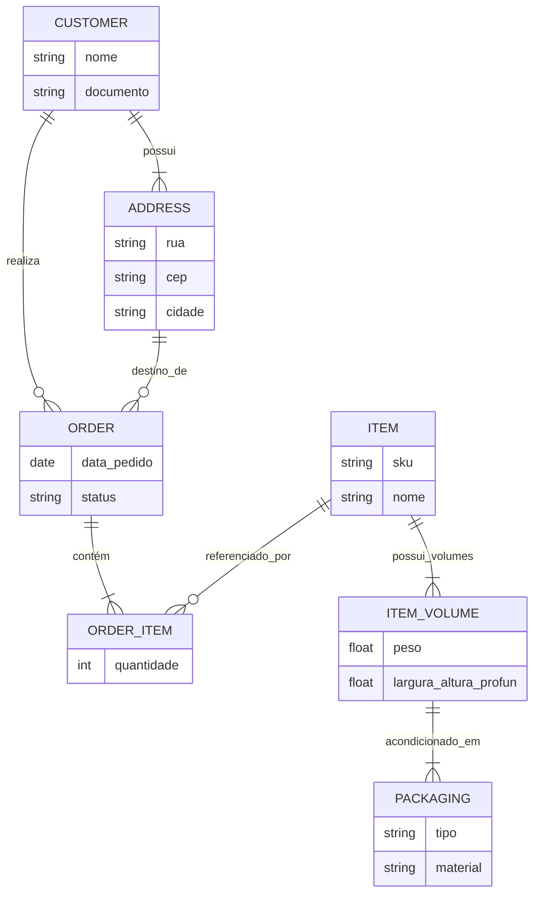

# Componentes da Aplicação (Apps)

O sistema é dividido em pequenos módulos visando a separação de responsabilidades (Clean Architecture e Django Apps convention).

## Diagrama de Entidade-Relacionamento (Perspectiva Logística)

O coração do sistema rege-se pelas seguintes relações de dados de faturamento e empacotamento:

## Aplicações e Diretórios

### Módulos Base (Raiz)

- `core`: Configurações principais do Django, Settings local e produção, rotas, views globais (ex: Health Check), e inicialização do `celery_app`.

### Lógica de Negócios (Diretório `apps/`)

#### 1. `authentication` (Segurança Unificada)
Gestão de formulários de Login, proteção das views via decorators e gerenciamento de permissões administrativas.

#### 2. `customers` e `addresses` (Base de Cadastros)
- **Customers**: Gerencia dados matrizes de clientes e compradores. 
- **Addresses**: Gerencia a base de endereços associada aos clientes ou destinos diretos de entrega.

#### 3. `products` (Catálogo e Dimensões)
Catálogo de itens para despacho. Preparado de forma avançada para o controle volumétrico da carga.
- **Modelos**:
  - `Item`: Produto macro unitário (SKU).
  - `ItemVolume`: Subdivisões lógicas ou módulos de um item completo.
  - `Packaging`: Caixas e embalagens que reúnem pesos definidos.

#### 4. `orders` (Pedidos/Romaneios)
O núcleo do sistema. Centraliza para onde a mercadoria vai e o quê está sendo transportado.
- **Modelos**: `Order` (Raiz), `OrderItem` (Quantidade demandada).

#### 5. `imports` (Motor de Integração)
Permite subir planilhas XLSX e PDFs exportados do sistema contábil, lê e traduz assincronamente (Celery) todas as linhas gerando os `Orders` em massa.

#### 6. `deliveries` (Rastreabilidade)
Controle futuro dos metadados de expedição e motoristas (rotas programadas).

#### 7. `ticket_printer` (Motor de Impressão Térmica)
Transforma objetos e Querysets do Django em coordenadas de texto puro `.zpl` ou pré-visualizações em PDF disparáveis às impressoras de balcão (via QZTray).

---
> 💡 *Atenção Devs*: A separação em mini-aplicativos viabiliza manutenções atômicas e isola contextos para os testes parametrizados (localizados na suíte `/tests/`).
