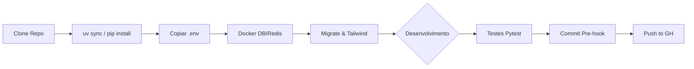
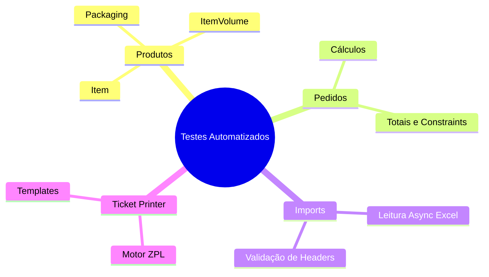

# Desenvolvimento e Setup Local

## Prê-Requisitos
1. **Python 3.12+** (Sugerido usar o `uv` para dependências rápidas: `pip install uv`)
2. **Docker e Docker Compose**
3. **Node.js** (Para o Tailwind)

## Iniciando o Ambiente de Desenvolvimento

### 1. Preparando o Virtualenv
```bash
uv venv
source .venv/bin/activate  # ou .venv\Scripts\activate no Windows
uv pip install -r pyproject.toml
```

### 2. Variáveis de Ambiente
Copie o exemplo para criar as suas próprias credenciais locais:
```bash
cp .env.example .env
```

### 3. Subindo Serviços de Apoio
Suba o Banco e o Redis através do Docker (já que a Stack completa pode ser pesada se rodada de uma vez só):
```bash
docker compose up dev-db dev-redis -d
```

### 4. Migrations, Superusuário e Frontend
```bash
python manage.py migrate
python manage.py createsuperuser
# Instalar pacotes de node do Tailwind e iniciar watcher
python manage.py tailwind install
python manage.py tailwind start
```
*Num Terminal Separado*:
```bash
python manage.py runserver
```

### Padrões de Código e Pre-Commit
Nós utilizamos `Ruff` e `Prettier`. Antes de commitar instale o hook:
```bash
pre-commit install
```

## Ciclo de Vida do Desenvolvimento (Dev Flow)



## Camada de Testes Automatizados (Pytest)

O projeto usa `pytest` para testes unitários e de integração, com foco especial nas regras logísticas e de multi-volumes.

### Como Rodar os Testes

<!-- INSERIR_SCREENSHOT: Terminal mostrando o output do pytest passando verde -->
> 🖼️ *[Captura de Tela do Terminal Rodando Testes Aqui]*

Para executar toda a suíte de testes:
```bash
pytest
```

**Opções Comuns:**
- `pytest -v`: Modo detalhado (verbose)
- `pytest -k "nome_do_teste"`: Filtra execução pelo nome
- `pytest --cov=.`: Gera relatório de cobertura de código
- `pytest -x`: Falha rápida (para no primeiro erro)

### Estrutura Visual dos Testes

A organização segue a divisão modular dos apps na pasta `/tests/`:


